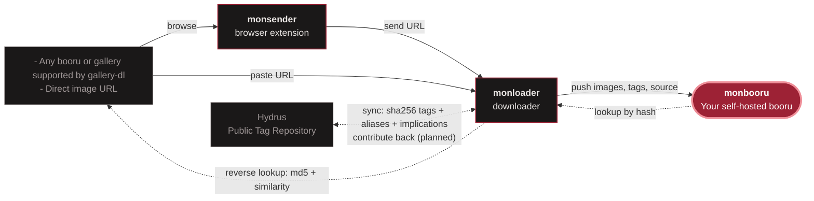

# Monbooru

Your own private, lightweight and fast booru.  
Designed for organizing your local media collection, including AI-generated images (Stable Diffusion, ComfyUI, A1111/Forge). Supports ONNX models for local auto-tagging of your collection (WD14, JoyTag...). The app itself never touches the internet; online features (downloading from boorus or reverse image lookup) are handled by [monloader](https://github.com/leqwin/monloader), an optional companion.

<table>
  <tr>
    <td></td>
    <td></td>
  </tr>
  <tr>
    <td></td>
    <td></td>
  </tr>
  <tr>
    <td></td>
    <td></td>
  </tr>
</table>

---

## Features

- **Tag-based gallery** with folder tree, favorites, saved searches, collections, related-image suggestions, and rating tags (general / sensitive / questionable / explicit) with a SFW ceiling
- **Stable Diffusion metadata** from A1111/Forge and ComfyUI: prompts, models, seeds, full workflows
- **Local ONNX auto-tagging** (WD14 SwinV2, JoyTag, Camie v2, or any compatible model) on CPU or GPU
- Images, video, animated GIFs, plus CBZ/ZIP archives browsed as a single object with a built-in manga reader; animated hover previews on the grid
- **Search** with wildcards, OR, exclusions, plus filters on folder, date, size, dimensions, category, generation recipe, and more
- **Keyboard-driven UI**: contextual shortcuts on every page, from grid navigation to batch actions; press `?` in-app for the full map
- **Tag management**: merge duplicates, create aliases, implications, custom categories
- **Image relations**: declared duplicates, alternates, version chains, derivatives; near-duplicate detection with a side-by-side review session and duplicate cleanup tools
- **Sources and provenance**: multiple sources per image, artist commentary and note boxes, plus your own per-image notes and annotations
- **Batch operations** on a selection or a whole search: delete, move, add/remove tags, auto-tag, set collection or source, toggle inbox/favorite, and more
- **File watcher** that catches new, moved, and deleted files within seconds; multi-file browser upload; SHA-256 dedup so the same file under two paths is one image
- **Inbox workflow** : new images land in the inbox for review
- **Multiple galleries** in one instance, each with its own filesystem and database; per-gallery export/import; import data from supported booru applications
- **REST API** for third-party integrations, with scoped bearer tokens, an OpenAPI spec, and built-in docs
- **Monloader integration (optional)** ([monloader](https://github.com/leqwin/monloader)) pulls images and tags from supported boorus and galleries, and reverse-looks up your own images against boorus, similarity services (IQDB, SauceNAO), and the Hydrus Public Tag Repository to backfill tags and sources; the PTR connection can also pull tag aliases and implications into your catalog
- **Optional password login**

---

## Technical overview

Monbooru compiles to a single self-contained binary (~18 MB, web assets embedded) with a handful of Go dependencies. Storage is one SQLite file per gallery (no database server, no cache layer, nothing else to run). Your collection stays ordinary files and folders on disk, the database and thumbnails live in a separate data directory, so removing monbooru leaves your images exactly where they were. The UI is server-rendered with no JS framework, no frontend build step, ~300 KB of static assets total. Memory scales with the library: a fresh instance starts around 25 MB of RAM, a small library idles around 50 MB, and a million-image library settles around 500 MB, flat over time, with typical pages still rendering in a few milliseconds at that scale. The heavy features stay out of the core process: ONNX auto-tagging is disabled by default and runs in a separate worker that unloads itself when idle, and everything online (downloading, reverse lookup) lives in the optional [monloader](https://github.com/leqwin/monloader) companion, so monbooru itself never touches the internet. The only external tool is ffmpeg, optional, for video and animated previews.

---

## Related applications

Monbooru is a self-hosted offline image organizer. Optional companions applications can be used for online features :

- **monbooru** : this application; organizes, tags, and serves your collection. 
- **[monloader](https://github.com/leqwin/monloader)** : downloader; fetches files and per-post metadata (via gallery-dl) and pushes them into a monbooru gallery over the REST API; also answers monbooru's reverse lookups (boorus, IQDB/SauceNAO, Hydrus PTR) and source refetches.
- **[monsender](https://github.com/leqwin/monsender)** : browser extension; sends the URL of the page you're currently browsing to monloader.

---

## Quick start (Docker)

Edit the volume paths in [`docker/docker-compose.yml`](docker/docker-compose.yml), then `docker compose up -d`. The app is available at `http://localhost:8080`.

See the [monbooru documentation](https://leqwin.github.io/mondocs/index.html) for help. In-app, type `system:` in the search bar for the syntax cheat-sheet and press `?` for the keyboard shortcuts; the footer's `help` link opens the documentation.

---

## Warning

> **Intended for local network use.** This project is not designed for direct exposure to the public internet.

---

## Acknowledgements

Thanks to [@gary-host-laptop](https://github.com/gary-host-laptop) for ongoing feature requests and feedback.
